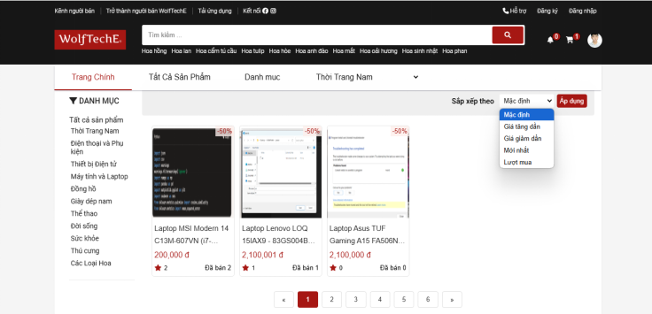

# Đề tài: [XÂY DỰNG HỆ THỐNG ĐỀ XUẤT CHO THƯƠNG MẠI ĐIỆN TỬ BÁN ĐỒ THỂ THAO SỬ DỤNG NODEJS,ANGULAR, FLUTTER VÀ MONGODB]

## Thông tin sinh viên

- **Họ và tên**: Phạm Nguyễn Hoàng Long
- **Mã số sinh viên**: 2254810081

## Nhóm thực hiện

- **Tên nhóm**: Nhóm 4 - WolfTeam
- **Thành viên**:
  - Thành viên 1: [Phạm Nguyễn Hoàng Long, 2254810081]
  - Thành viên 2: [Ngô Văn Đức Thịnh, 2254810313]
  - Thành viên 3: [Ma Thị Hồng Phúc, 2254810074]
  - Thành viên 4: [Đặng Võ Tùng Dương, 2254810311]

## Thông tin khoa

- **Khoa**: Khoa Công nghệ Thông tin

## Nội dung đề tài

- **Nền tảng Website**:
  - Thiết kế giao diện trên website sử dụng Angular18
  - Xây dựng REST API, chức năng bằng ExpressJS, NodeJS
  - Sử dụng cơ sở dữ liệu NoSQL: MongoDB

### Hình ảnh minh họa

- **Nền tảng Mobile**:
  - Thiết kế giao diện trên mobile sử dụng Flutter
  - Xây dựng REST API, chức năng bằng ExpressJS, NodeJS
  - Sử dụng cơ sở dữ liệu NoSQL: MongoDB

### Hình ảnh minh họa

- **Hệ thống đề xuất**:
  - Sử dụng phương pháp matrix factorization collaborative filtering để đề xuất sản phẩm dựa theo số điểm đánh giá của người dùng trong cơ sở dữ liệu của hệ thống
    
